# 労働力調査 長期時系列分析レポート

**出典：** 総務省統計局「労働力調査 長期時系列データ」  
**対象期間：** 1953年〜2026年（月次）  
**作成日：** 2026年3月  
**作成者：** Sur Communication Inc.

---

## エグゼクティブサマリー

本レポートは、総務省統計局が公表する労働力調査の長期時系列データを分析し、戦後から現在までの日本の就業構造・失業動向・雇用形態の変化を多角的に考察したものです。

### 主要知見

| テーマ | 指標 | 最新値（2026年1月） |
|--------|------|---------------------|
| 就業者数 | 就業者総数 | 6,776万人 |
| 完全失業率 | 全体 | 2.6%（歴史的低水準） |
| 非正規比率 | 非正規雇用者割合 | 36.9% |
| 高齢者就業 | 65歳以上就業者 | 約912万人（2025年） |
| 農林業就業 | 農業・林業就業者 | 約195万人（全体の2.9%） |

---

## 1. 主要労働力指標の長期推移

### 図1: 主要労働力指標の長期推移（1953〜2025年）

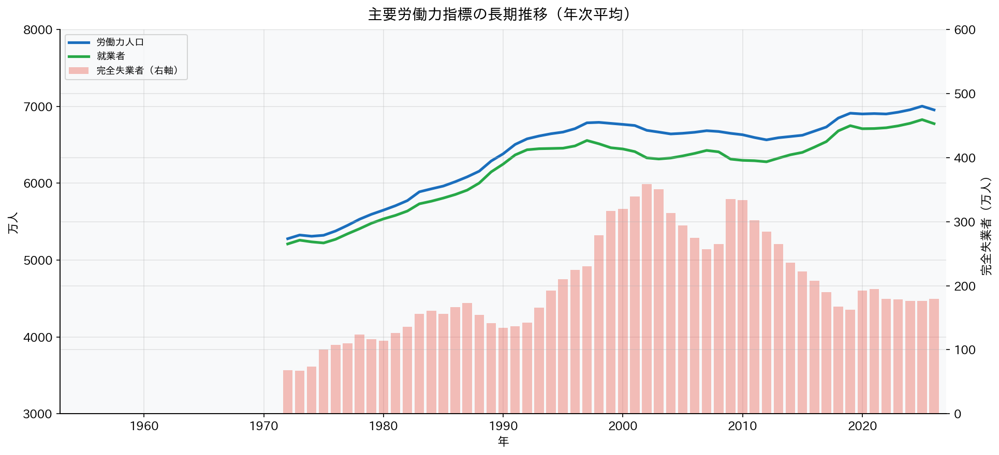

**データポイント（主要指標）：**

- 就業者数: 1953年約3,680万人 → 2025年約6,776万人（+84%）
- 労働力人口: 1953年約3,800万人 → ピーク約6,793万人（1998年）
- 完全失業者数: バブル崩壊後に急増、2002年に約359万人でピーク

高度経済成長期（1955〜1973年）には年率10%前後の経済成長を背景に就業者数が急増。1990年代のバブル崩壊後は停滞し、2002年頃に構造的失業が最大化した。2013年以降のアベノミクスによる雇用拡大局面では就業者数・労働力人口ともに回復基調となっている。

---

## 2. 完全失業率の長期推移

### 図2: 完全失業率の長期推移（1953〜2026年）

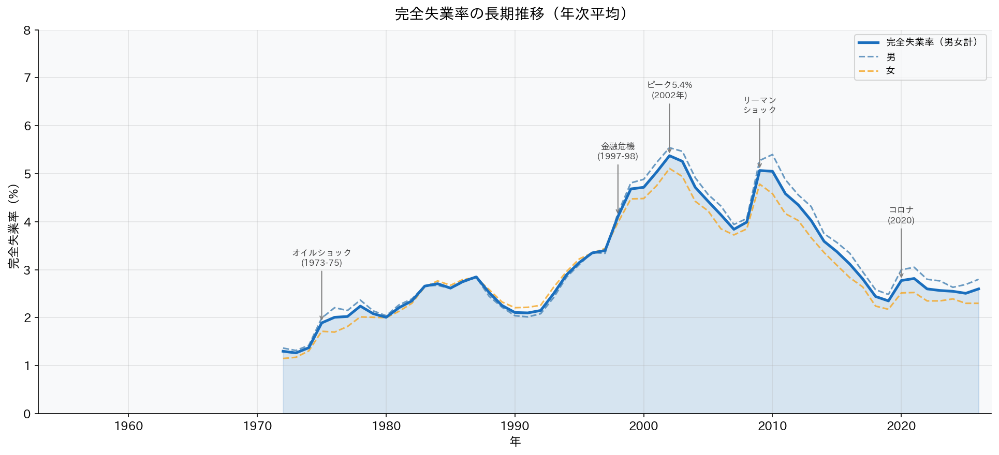

**局面別の変化：**

| 局面 | 期間 | 失業率水準 |
|------|------|-----------|
| 高度成長期 | 1953〜1973年 | 1%台の超低水準 |
| 石油危機後 | 1974〜1990年 | 2〜3%台に上昇 |
| バブル崩壊後 | 1991〜2012年 | 段階的に上昇、2002年ピーク5.4% |
| 回復局面 | 2013〜2019年 | 2%台に低下 |
| コロナ禍 | 2020〜2021年 | 一時3%超 |
| 現在 | 2022〜2026年 | 2.5〜2.6%（歴史的低水準） |

完全失業率2.6%（2026年1月）は、戦後の長期推移の中でも極めて低い水準にある。人手不足が慢性化する中、摩擦的失業・構造的失業が低下している。

---

## 3. 完全失業率の構造変化

### 図3: 完全失業率の月次推移（季節調整値 vs 原数値）

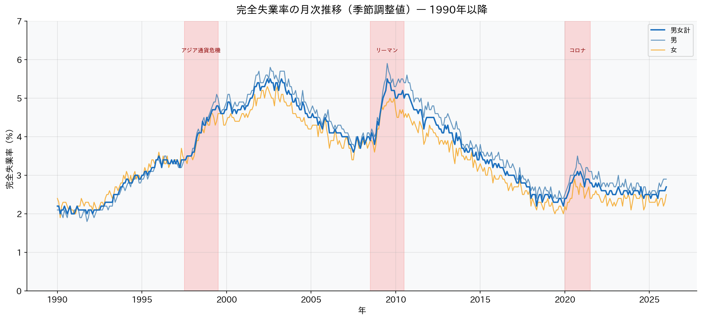

原数値は春（3〜4月）に高く、秋（9〜10月）に低い季節性を持つ。季節調整値は学校卒業後の入職パターンを補正し、実態の景気動向をより正確に反映する。

**直近の動向（2026年1月）：**
- 季節調整済み完全失業率: 2.6%
- コロナ禍のピーク（2020年10月）: 3.0%からの回復を達成

### 図8: 地域別完全失業率の比較

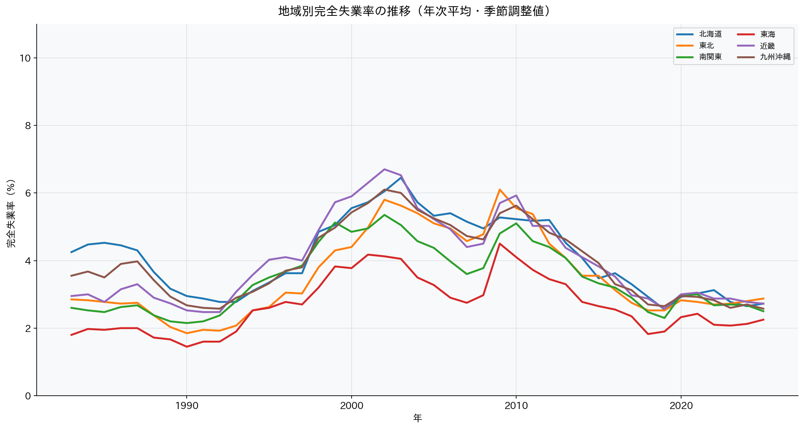

**地域別格差の特徴：**

- 高め: 北海道・近畿・沖縄（第三次産業依存、観光業の影響）
- 低め: 北陸・東海・北関東（製造業集積、安定した雇用基盤）
- 全国平均2.6%に対し、地域間で最大1〜2ptの差が存在

---

## 4. 正規・非正規雇用の推移

### 図4: 正規・非正規雇用者数の推移

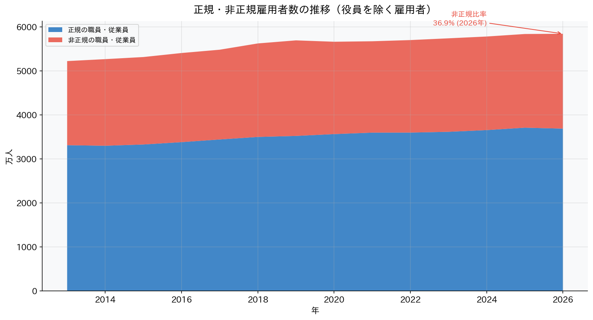

**2026年1月 最新値：**

| 区分 | 人数 | 前年比 |
|------|------|--------|
| 正規雇用者 | 3,687万人 | +27万人 |
| 非正規雇用者 | 2,155万人 | +43万人 |
| 非正規比率 | 36.9% | — |

**非正規化の歴史的変遷：**

1980年代：非正規比率 約15%  
1990年代：バブル崩壊後、コスト削減目的での非正規化が加速  
2000年代：非正規比率が30%台に突入  
2013年以降：正規・非正規ともに増加傾向  

非正規雇用には派遣・パート・アルバイト・契約社員・嘱託・その他を含む。働き方の多様化と企業のコスト管理の両面から非正規化が進行した。

---

## 5. 年齢・就業形態別構造

### 図5: 年齢別就業者数の推移

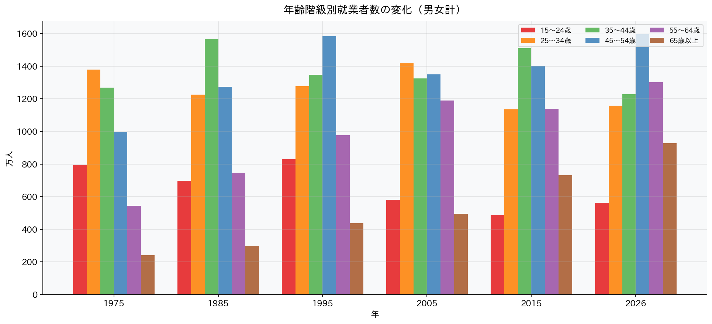

**高齢化と就業構造の変化：**

- 15〜64歳（生産年齢）就業者: 少子化・人口減少により減少基調
- 65歳以上就業者: 2000年代以降に顕著な増加
- 2025年: 65歳以上就業者 約912万人（全体の約13.5%）

定年延長・継続雇用制度の普及により、高齢者就業率が上昇。人口減少社会において高齢者就業が全体の就業者数を下支えしている。

### 図6: 就業形態別推移（雇用者・自営業・家族従業者）

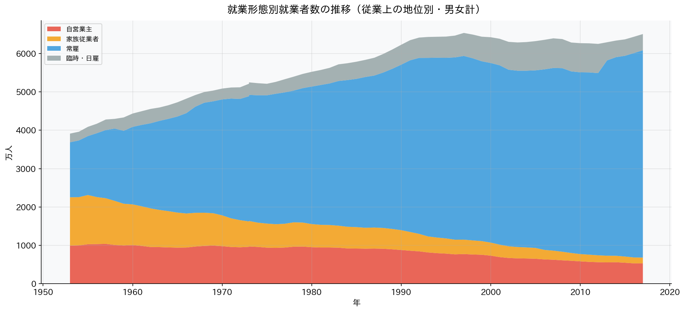

**就業形態の変化（1953年→2025年）：**

| 形態 | 1953年 | 2025年 |
|------|--------|--------|
| 雇用者比率 | 約52% | 約90% |
| 自営業主 | 高水準 | 大幅減少 |
| 家族従業者 | 高水準 | 大幅減少 |

農業・商業の縮小とともに自営業主・家族従業者が大幅に減少し、雇用社会化が長期トレンドとして進展した。

---

## 6. 産業構造の変化

### 図7: 主要産業別就業者数の長期推移

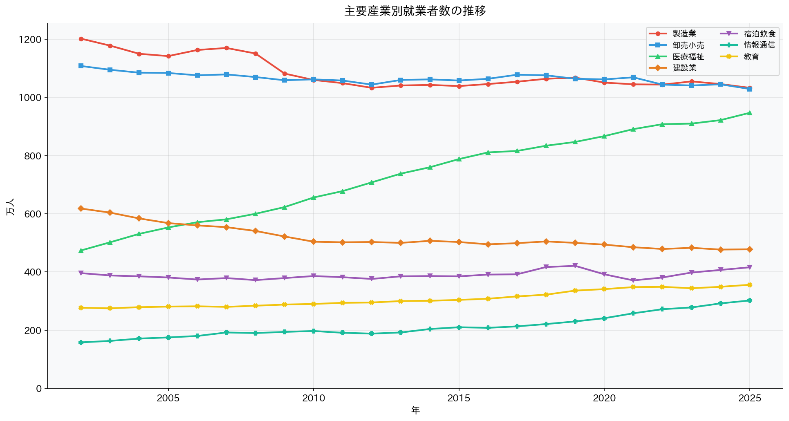

**産業別変化（概要）：**

- 製造業: 1990年代前半にピーク（約1,400万人）後、縮小
- 卸売・小売業: 長期的に横ばい〜微減
- 医療・福祉: 2000年代以降に急拡大（高齢化対応・介護需要増）
- 情報通信業: デジタル化の進展により着実に拡大
- 農業・林業: 長期的に縮小が続く

### 図12: 産業シェア比較（2002年 vs 2025年）

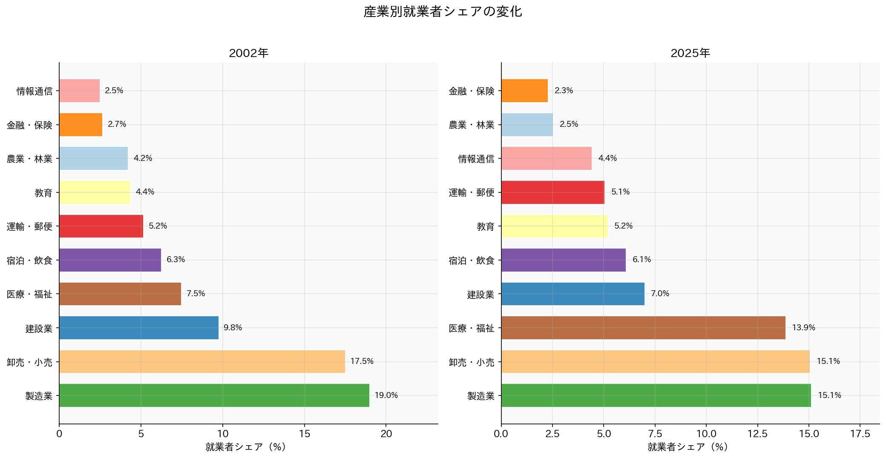

2002年から2025年にかけての産業シェア変化は日本の経済構造転換を如実に示す。製造業の空洞化が進む一方、医療・福祉・情報通信の拡大が顕著となっている。

---

## 7. 農業・林業から非農林業への転換

### 図10: 農業・林業就業者数の長期推移

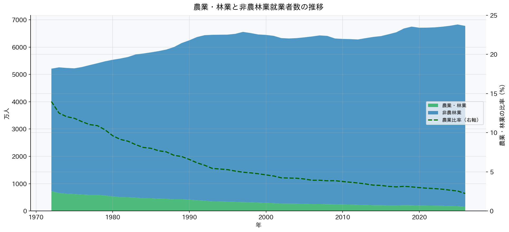

**農林業就業者数の変遷：**

| 年 | 農林業就業者数 | 全就業者比率 |
|----|---------------|------------|
| 1953年 | 約1,600万人 | 約44% |
| 1970年 | 約900万人 | 約18% |
| 1980年 | 約530万人 | 約10% |
| 2000年 | 約320万人 | 約5% |
| 2025年 | 約195万人 | 約2.9% |

高度経済成長期に急速に進んだ農業から製造業・サービス業への労働力移動は、日本の産業構造転換の象徴的な変化である。現在は農業就業者の高齢化・後継者不足が深刻な課題となっている。

---

## 8. 男女別労働力参加

### 図9: 男女別完全失業率の推移

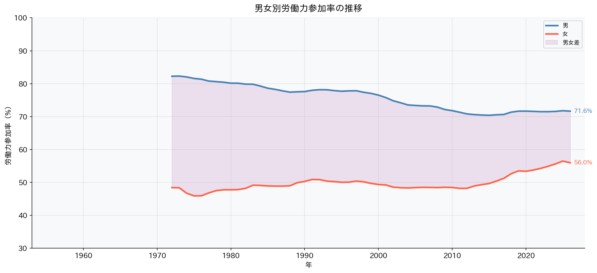

**2026年1月 最新値：**

| 性別 | 完全失業率 |
|------|-----------|
| 男性 | 2.9% |
| 女性 | 2.5% |

**男女差の変化：**

- 1990年代以前: 男性の方が失業率が低い傾向
- 2000年代以降: 男女差が縮小
- 近年: 女性の方が低い水準で推移（非正規も含めた就業機会増）

女性の労働力率はM字カーブの解消が進み、育児期間中の離職が減少。政府の女性活躍推進策（女性活躍推進法等）の効果もあり、女性就業者数は過去最高水準を更新している。

---

## 9. 地域別雇用格差ヒートマップ

### 図11: 地域別雇用指標ヒートマップ

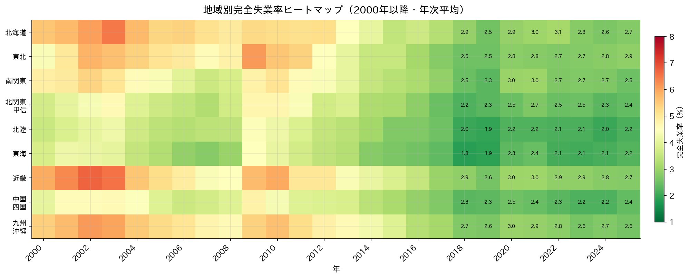

**地域別格差の構造：**

| 地域 | 特徴 | 失業率傾向 |
|------|------|-----------|
| 北海道・近畿・沖縄 | 第三次産業依存、観光業の影響 | 高め |
| 北陸・東海・北関東 | 製造業集積、安定した雇用基盤 | 低め |
| 首都圏・中部 | 多様な産業集積 | 中程度 |

就業率は地域の産業構造・人口構成を反映しており、地方圏での人口流出と労働力不足が深刻化している。

---

## 10. 総合考察

### 主要知見のまとめ

| テーマ | 主な知見 |
|--------|---------|
| 長期トレンド | 就業者6,776万人（2026年1月）、完全失業率2.6%（歴史的低水準） |
| 非正規化の進展 | 非正規比率36.9%（2026年1月）。2013年以降は正規・非正規ともに増加 |
| 高齢化と就業構造 | 65歳以上就業者が増加傾向。高齢者就業が全体を下支え |
| 産業構造転換 | 製造業の縮小、医療福祉・情報通信の拡大が顕著 |
| 地域格差 | 北海道・近畿で失業率やや高め。地域間で最大1〜2ptの差 |
| 男女別 | 近年は女性失業率（2.5%）が男性（2.9%）を下回る局面も |

### 政策的示唆

1. **女性・高齢者の就業促進**  
   M字カーブは解消方向にあるが、育児・介護と就業の両立支援が引き続き重要。65歳以上の就業機会拡大は労働力不足対策として有効。

2. **非正規雇用の処遇改善**  
   非正規比率36.9%の中、同一労働同一賃金の実効性向上が求められる。非正規から正規への転換支援策の充実が必要。

3. **産業構造転換への対応**  
   製造業縮小に伴うリスキリング（学び直し）支援。医療福祉・情報通信分野の人材育成が急務。

4. **地域雇用格差の是正**  
   北海道・近畿・沖縄など失業率が高い地域での産業振興策。地方移住・就業促進による地域活性化。

5. **農業・林業の担い手確保**  
   就業者195万人まで減少した農林業の持続可能性確保。スマート農業・農業法人化による生産性向上が鍵。

### データの限界・注意点

- 本レポートで使用したデータは公表値のみであり、調査設計の変更点に注意が必要
- 2011年3月（東日本大震災）の影響により、岩手・宮城・福島の一部データに欠損
- 非正規雇用の定義は調査年度によって一部変更あり
- 地域別データは都道府県単位の集計であり、市区町村間格差は別途分析が必要
- 季節調整値は毎月改定されるため、過去の数値が遡及修正される場合がある

---

**データソース：** 総務省統計局「労働力調査 長期時系列データ」  
**データ取得先：** https://www.stat.go.jp/data/roudou/longtime/03roudou.html  
Edited by Sur Communication Inc.
