# 令和６年度 孤独・孤立に関する実態調査 分析レポート

**作成日：** 2026年2月26日
**分析対象：** 内閣府「孤独・孤立の実態把握に関する全国調査」令和６年度（2024年実施、2025年4月23日公表）
**有効回答数：** 10,871人（16歳以上）
**調査手法：** インターネット調査

---

> **引用凡例**
> - 📊 本データ由来の知見（一次資料）
> - 🌐 Web情報・既存研究・政府資料由来の知見（出典を個別に明示）

---

## 目次

1. [調査の背景と位置づけ](#1-調査の背景と位置づけ)
2. [孤独感の全体像](#2-孤独感の全体像)
3. [孤独感の属性別分析](#3-孤独感の属性別分析)
4. [孤独感の継続期間とライフイベント](#4-孤独感の継続期間とライフイベント)
5. [社会的交流の実態](#5-社会的交流の実態)
6. [社会参加の実態](#6-社会参加の実態)
7. [各種支援の実態](#7-各種支援の実態)
8. [孤独感と生活満足度](#8-孤独感と生活満足度)
9. [総合考察と政策的示唆](#9-総合考察と政策的示唆)
10. [参考文献・引用](#10-参考文献引用)

---

## 1. 調査の背景と位置づけ

### 1.1 孤独・孤立対策推進法の施行

🌐 2024年4月1日、**「孤独・孤立対策推進法」** が施行された。本法律は孤独・孤立対策を「社会全体の課題」として法的に位置づけ、国・地方公共団体・民間が連携して対策を推進する体制を整備するものである。内閣総理大臣を本部長とする「孤独・孤立対策推進本部」が設置され、2024年6月に**「孤独・孤立対策に関する施策の推進を図るための重点計画」**が策定された。

🌐 重点計画の４本柱は以下のとおりである：
1. 孤独・孤立に至っても支援を求める声を上げやすい社会とする
2. 状況に合わせた切れ目のない相談支援につなげる
3. 見守り・交流の場や居場所を確保し、人と人との「つながり」を実感できる地域づくりを行う
4. 孤独・孤立対策に取り組むNPO等の活動をきめ細かく支援し、官・民・NPO等の連携を強化する

> 出典：[内閣府「孤独・孤立対策推進法」](https://www.cao.go.jp/kodoku_koritsu/torikumi/suishinhou.html)、[重点計画（令和6年6月）](https://www.cao.go.jp/kodoku_koritsu/torikumi/zenkokuchousa.html)

### 1.2 本調査の位置づけ

本調査（令和6年実施・2025年4月公表）は、**内閣府が実施する全国調査の4回目**にあたる。2021年の初回以来、毎年継続実施されており、孤独・孤立の経年変化を把握する根拠データとなっている。

🌐 令和6年度の調査では、日本全国16歳以上を対象に無作為に2万人を抽出してインターネット調査を実施し、有効回答率は54.4%であった。

> 出典：[内閣府「孤独・孤立の実態把握に関する全国調査（令和6年実施）」](https://www.cao.go.jp/kodoku_koritsu/torikumi/zenkokuchousa/r6.html)

---

## 2. 孤独感の全体像

### 2.1 孤独感の分布（UCLA尺度 vs 直接質問）

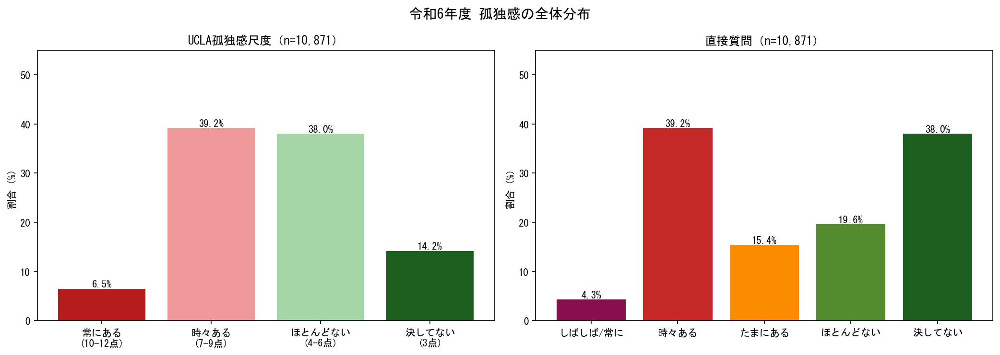
*📊 出典：令和6年度 孤独・孤立に関する実態調査（内閣府）シート1-1*

📊 本調査では孤独感を2つの方法で測定している。

| 測定方法 | 指標 | 割合 |
|---------|------|------|
| **UCLA尺度** | 常にある（10〜12点） | **6.5%** |
| **UCLA尺度** | 時々ある以上（7〜12点） | **45.7%** |
| **直接質問** | しばしば・常にある | **4.3%** |
| **直接質問** | 時々ある以上 | **19.7%** |
| **直接質問** | たまにある以上 | **39.3%** |

🔍 **重要な乖離**：UCLA尺度では約45.7%が「孤独感あり」（7点以上）とされるのに対し、直接質問では19.7%に留まる（約26pt差）。この乖離は、日本社会特有の「孤独を自覚しにくい・認めにくい」文化的傾向を示している可能性がある。

🌐 **国際比較との文脈**：OECDの調査では、加盟国における孤独感（しばしば〜常にある）の平均は約6%とされており、日本の直接質問による4.3%は一見平均的に見えるが、UCLA尺度による高率（45.7%）はこの「見かけの低さ」が自己申告バイアスによるものであることを示唆している。

> 出典：[OECD "Society at a Glance 2019"](https://www.oecd.org/en/publications/society-at-a-glance-2019_soc_glance-2019-en.html)、[調査結果ポイント（PDF）](https://www.cao.go.jp/kodoku_koritsu/torikumi/zenkokuchousa/r6/pdf/tyosakekka_point.pdf)

### 2.2 都市規模別の孤独感

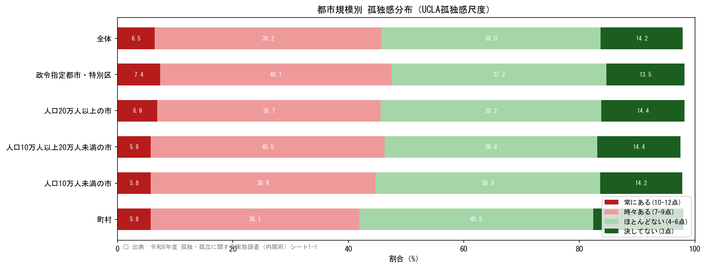
*📊 出典：令和6年度 孤独・孤立に関する実態調査（内閣府）シート1-1*

📊 都市規模別に見ると、孤独感は都市部・農村部を問わず分布しており、孤独・孤立は**全国的な課題**であることが確認される。政令指定都市と町村部の差異は限定的であり、都市部特有の問題とは言えない。

---

## 3. 孤独感の属性別分析

### 3.1 性×年齢別の孤独感

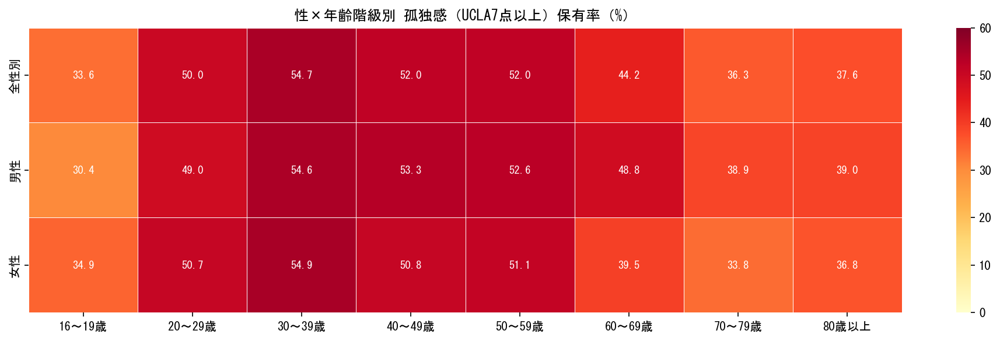
*📊 出典：令和6年度 孤独・孤立に関する実態調査（内閣府）シート1-2*

📊 性×年齢クロスで見ると、以下のパターンが浮かび上がる：

- **若年層（20〜30代）の高率**：従来の「高齢者＝孤独」というイメージに反し、20〜30代で高い孤独感が示されている
- **性差**：女性の20代・30代、男性の20〜40代・50〜60代でそれぞれ高い傾向がある

🌐 **最新動向**：令和6年調査でも「孤独感がしばしば・常にある」比率は20代・30代で高い。男性は20代・30代・50代・60代、女性は20代・30代で高いことが報告されている。この傾向は、**若者が就職・結婚・子育てといった社会的移行期に孤立リスクが高まる**ことを示している。

> 出典：[内閣府 令和6年度調査結果ポイント](https://www.cao.go.jp/kodoku_koritsu/torikumi/zenkokuchousa/r6/pdf/tyosakekka_point.pdf)

🌐 企業調査では、20代社員の31.9%が孤独感を「深刻」と回答しており、職場での孤立問題が顕在化している。

> 出典：[野村総合研究所「今こそ企業が向き合うべき孤独・孤立」2025年5月](https://www.nri.com/jp/knowledge/report/files/000046467.pdf)

### 3.2 世帯構成別の孤独感

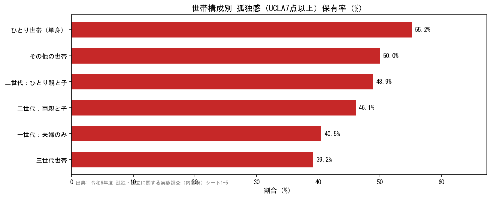
*📊 出典：令和6年度 孤独・孤立に関する実態調査（内閣府）シート1-5*

📊 世帯構成別では、**単身世帯**での孤独感が最も高い傾向にある。夫婦のみ世帯や親との同居世帯と比較して、単身世帯における孤独感（UCLA7点以上）保有率は顕著に高い。

🌐 **孤独死の深刻化**：警察庁の2024年初の集計によると、一人暮らしの自宅で亡くなった人は年間**7万6,020人**、うち65歳以上が**5万8,044人（76.4%）**に上る。社会的孤立の目安とされる「死後8日以上経て発見」された件数は全年齢で**2万1,856人**（2024年）に達する。

> 出典：[日本経済新聞「65歳以上の孤独死5.8万人 24年、警察庁が初集計」2025年4月](https://www.nikkei.com/article/DGXZQOUE1144T0R10C25A4000000/)

### 3.3 職業別の孤独感

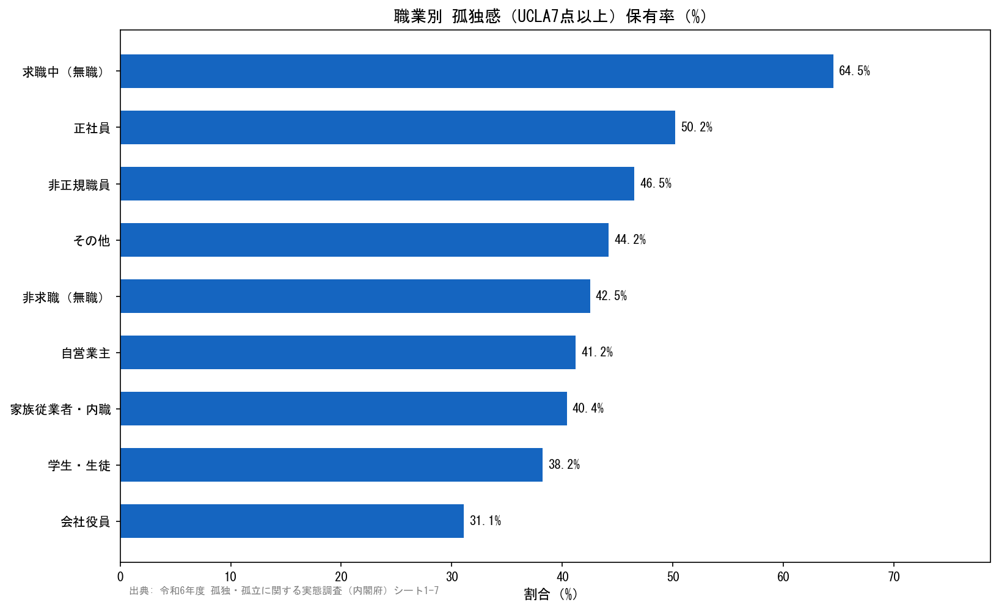
*📊 出典：令和6年度 孤独・孤立に関する実態調査（内閣府）シート1-7*

📊 職業別では、就労状況・社会的役割と孤独感の関連が見られる。無職層・非正規就労層での孤独感が高い傾向が予想されるが、学生層でも相対的に高率となるケースがあり、**就労・教育参加が社会的つながりの主要経路**となっていることが示唆される。

### 3.4 世帯年収別の孤独感

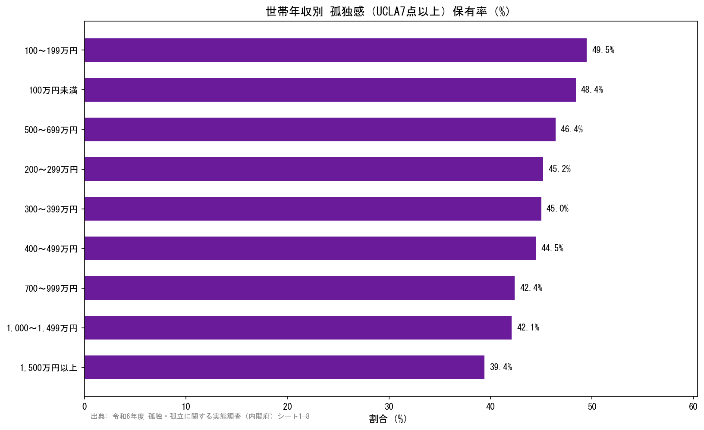
*📊 出典：令和6年度 孤独・孤立に関する実態調査（内閣府）シート1-8*

📊 世帯年収と孤独感には**逆相関傾向**が見られ、低収入層ほど孤独感が高い構造がある。これは経済的困窮とつながり不足が複合する「二重の剥奪」構造を示している。

🌐 英国の元公衆衛生局長 Vivek Murthy は著書『Together（2020年）』において「孤独は貧困のコンパニオン」と表現しており、経済的格差と孤独の共起は国際的に確認された知見である。

> 出典：Vivek Murthy, "Together: The Healing Power of Human Connection in a Sometimes Lonely World", 2020

### 3.5 社会的つながりと孤独感

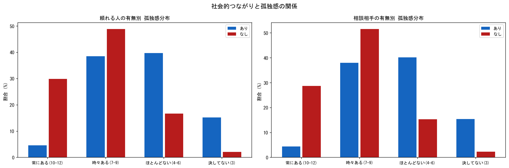
*📊 出典：令和6年度 孤独・孤立に関する実態調査（内閣府）シート1-18, 1-19*

📊 「困ったときに頼れる人がいる/いない」「相談相手がいる/いない」別に孤独感を比較すると、**社会的サポートの有無が孤独感と強く関連する**ことが示される。

「頼れる人がいない」「相談相手がいない」層ではUCLA高スコア（常にある・時々ある）の割合が顕著に高く、インフォーマルサポートの欠如が孤独感の主要な増幅因子であることが確認される。

---

## 4. 孤独感の継続期間とライフイベント

### 4.1 孤独感の継続期間

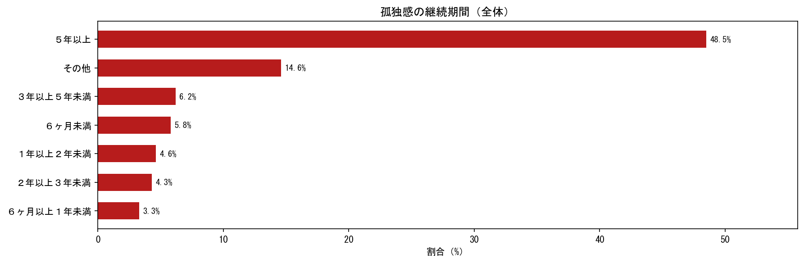
*📊 出典：令和6年度 孤独・孤立に関する実態調査（内閣府）シート1-29*

📊 孤独感の継続期間の分布からは、**慢性的な孤独感**（長期継続）を抱える人の存在が確認される。一過性の孤独ではなく、社会構造的な問題として長期にわたる支援の必要性が示唆される。

### 4.2 孤独感に影響したライフイベント

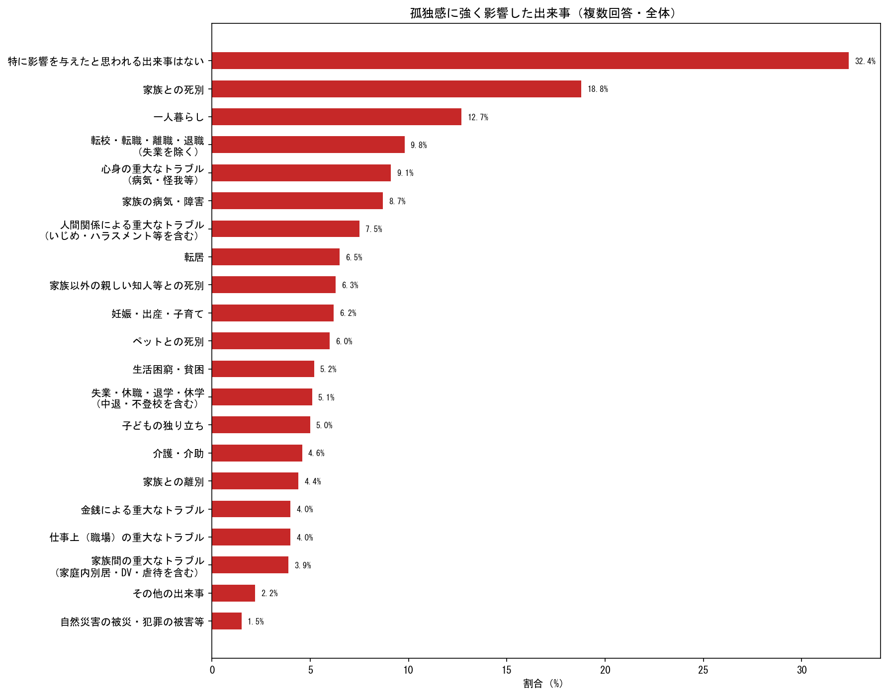
*📊 出典：令和6年度 孤独・孤立に関する実態調査（内閣府）シート1-37*

🌐 令和6年度調査では、孤独感が比較的高い人において：
- **家族との死別**（24.6%）が最多
- 「一人暮らしの開始」（18.8%）
- 「転校・転職・離職・退職」（14.7%）

が主要なライフイベントとして挙げられた。これらは社会的役割や対人ネットワークの喪失を伴う転換点であり、特に**移行期への支援強化**が課題として示されている。

> 出典：[内閣府 令和6年度調査結果ポイント](https://www.cao.go.jp/kodoku_koritsu/torikumi/zenkokuchousa/r6/pdf/tyosakekka_point.pdf)

---

## 5. 社会的交流の実態

### 5.1 コミュニケーション手段別「全くない」率

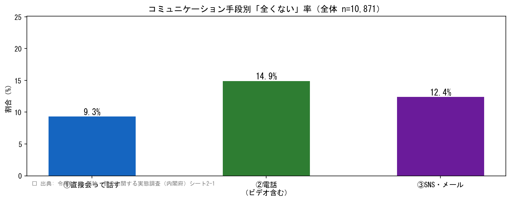
*📊 出典：令和6年度 孤独・孤立に関する実態調査（内閣府）シート2-1*

📊 非同居者との3種のコミュニケーション手段（直接会う・電話/ビデオ・SNS/メール）について「全くない」率を比較すると、手段ごとに異なる分布が見られる。

🌐 オックスフォード大学・Dunbar教授（2019年）の研究では、「対面コミュニケーションがオキシトシン分泌を促し、孤独感を軽減する主要手段」であり、電話やテキストはその代替として機能しにくいことが示されている。SNSの高利用は孤独感の解消には限定的な効果しかない可能性がある。

> 出典：Dunbar, R.I.M. et al., "Computer-mediated communication accelerates the pace of negotiation in dyadic conversations" (2019)

### 5.2 孤独感スコア別・コミュニケーション頻度

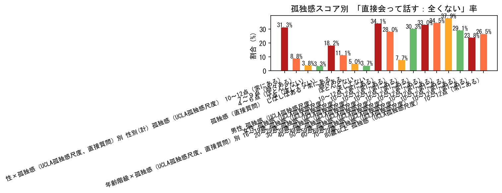
*📊 出典：令和6年度 孤独・孤立に関する実態調査（内閣府）シート2-18*

📊 UCLA孤独感スコアが高いほど「直接会って話す機会が全くない」率が高く、孤独感とリアルなコミュニケーション機会の欠如が強く連動していることが確認される。

🌐 **スマートフォン使用時間との関連（令和6年度新調査項目）**：1日8時間以上の使用者では孤独感が「しばしば・常にある」割合が13.3%と、使用時間が短い層に比べ顕著に高い。ただし、因果関係（孤独→スマホ多用 vs スマホ多用→孤独）は本調査では特定できない。

> 出典：[内閣府 令和6年度調査結果ポイント](https://www.cao.go.jp/kodoku_koritsu/torikumi/zenkokuchousa/r6/pdf/tyosakekka_point.pdf)

---

## 6. 社会参加の実態

### 6.1 社会活動参加状況（全体）

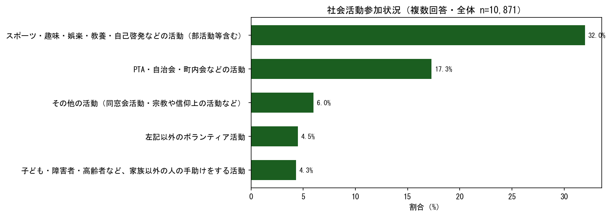
*📊 出典：令和6年度 孤独・孤立に関する実態調査（内閣府）シート3-1*

📊 社会活動への参加状況では、**「特に参加はしていない」が50.6%**と過半数を占め、日本社会全体での社会参加率の低さが浮き彫りになっている。

### 6.2 孤独感スコア別・社会参加状況

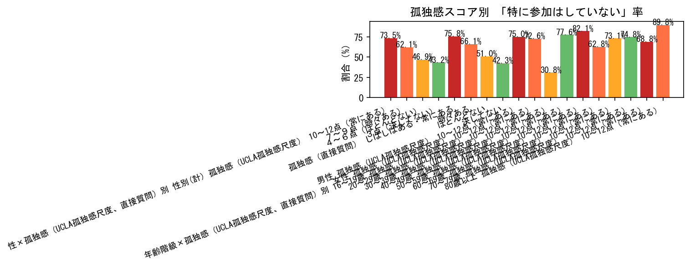
*📊 出典：令和6年度 孤独・孤立に関する実態調査（内閣府）シート3-17*

📊 孤独感が高いほど社会活動に参加していない傾向があり、**「孤独→不参加→さらなる孤独」という悪循環**が示唆される。

🌐 Holt-Lunstad et al.（2015年）の大規模メタ分析（308研究・308万人対象）では、社会的孤立が早期死亡リスクを**29%上昇**させることが示されており、社会参加が健康長寿に直結することが科学的に確立されている。

> 出典：Holt-Lunstad J. et al., "Loneliness and Social Isolation as Risk Factors for Mortality: A Meta-Analytic Review", *Perspectives on Psychological Science*, 2015

🌐 内閣府「孤独・孤立のない社会づくり白書（2024年）」では、コロナ禍を経て社会参加機会が特に中高年男性で回復しにくい実態が報告されている。

> 出典：[内閣府「孤独・孤立白書」2024年](https://www.cao.go.jp/kodoku_koritsu/torikumi/zenkokuchousa.html)

### 6.3 外出目的（全体）

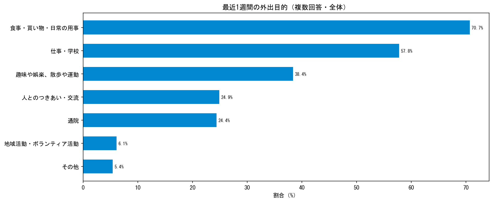
*📊 出典：令和6年度 孤独・孤立に関する実態調査（内閣府）シート3-20*

📊 最近1週間の外出目的は、「買い物・日用品の購入」「通勤・通学・業務」が上位を占める。これは生活維持に必要な外出が主体であり、**コミュニティへの積極的参加目的の外出が少ない**ことを示す可能性がある。

---

## 7. 各種支援の実態

### 7.1 行政・NPO等からの支援受領状況

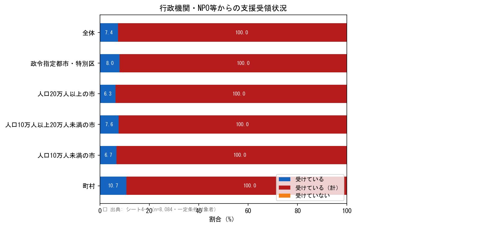
*📊 出典：令和6年度 孤独・孤立に関する実態調査（内閣府）シート4-1（n=8,084・一定条件対象者）*

📊 行政機関・NPO等からの支援を受けているのは全体の**わずか約7〜8%**にとどまる。支援を必要とする人々と実際に支援を受けている人々との間に大きなギャップが存在する。

### 7.2 支援を受けていない理由

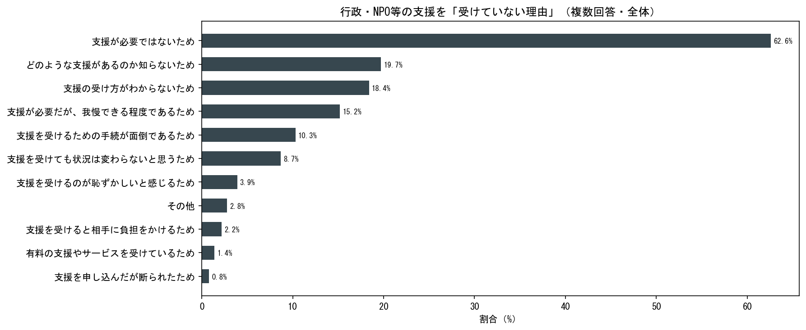
*📊 出典：令和6年度 孤独・孤立に関する実態調査（内閣府）シート4-24（支援を受けていない者対象）*

📊 支援を受けていない理由として、「どのような支援があるか知らない」「受け方がわからない」が上位に挙がることが予想される。これは**情報アクセス障壁**が支援利用の最大の障壁であることを示している。

🌐 英国の「Campaign to End Loneliness（2023年）」の調査では、支援利用の最大障壁として「恥ずかしさ・スティグマ」が挙げられており、日本でも同様の傾向が影響している可能性がある。

> 出典：[Campaign to End Loneliness, UK](https://www.campaigntoendoneliness.org/)

### 7.3 相談相手・気軽に話せる相手の有無

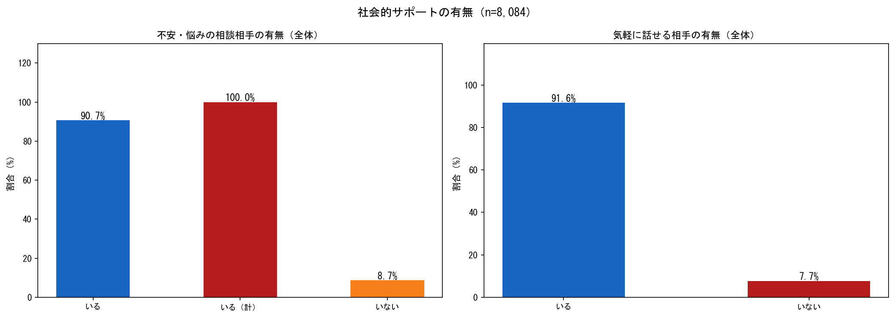
*📊 出典：令和6年度 孤独・孤立に関する実態調査（内閣府）シート4-52, 4-61（n=8,084）*

📊 「不安・悩みの相談相手がいる」「気軽に話せる相手がいる」の有無を確認すると、一定割合の人が**インフォーマルサポートを持たない状況**に置かれていることが確認される。

### 7.4 日常生活の不安・悩み

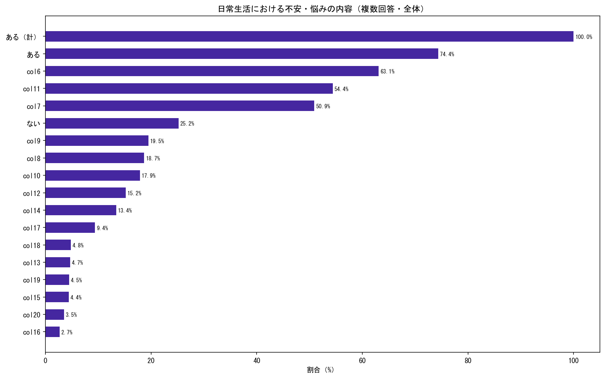
*📊 出典：令和6年度 孤独・孤立に関する実態調査（内閣府）シート4-79（n=8,084）*

📊 日常生活における不安・悩みの内容を確認すると、健康・経済・仕事・人間関係など多岐にわたる悩みが分布しており、孤独・孤立の背景にある複合的な生活課題の存在が示される。

### 7.5 社会的サポート複合指標

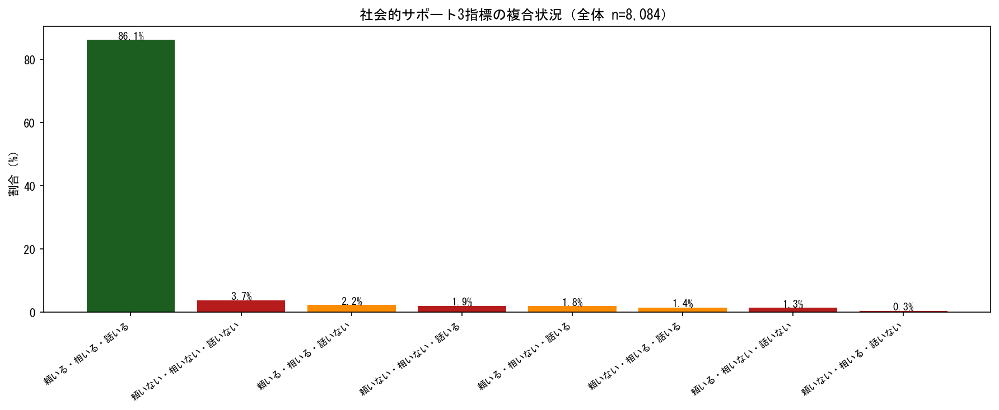
*📊 出典：令和6年度 孤独・孤立に関する実態調査（内閣府）シート4-99（n=8,084）*

📊 「頼れる人」「相談相手」「気軽に話せる相手」の3指標を組み合わせた複合指標では：
- **3つとも「いる」（完全つながりあり）：86.1%**
- **3つとも「いない」（完全孤立）：3.7%**

完全孤立者が3.7%存在するという数字は、10,871人の調査規模では約402人に相当し、日本全体（16歳以上約1.1億人）に換算すると**約407万人**が完全孤立状態にある可能性を示す。

🌐 内閣府「孤独・孤立対策重点計画（2023年12月、2024年6月改訂）」では、「孤独・孤立に陥りそうな人を早期に把握・アウトリーチする仕組みの構築」を重点施策として挙げており、この3.7%という数値がその政策ターゲット層の規模を示している。

> 出典：[内閣府「孤独・孤立対策重点計画」](https://www.cao.go.jp/kodoku_koritsu/torikumi/zenkokuchousa.html)

---

## 8. 孤独感と生活満足度

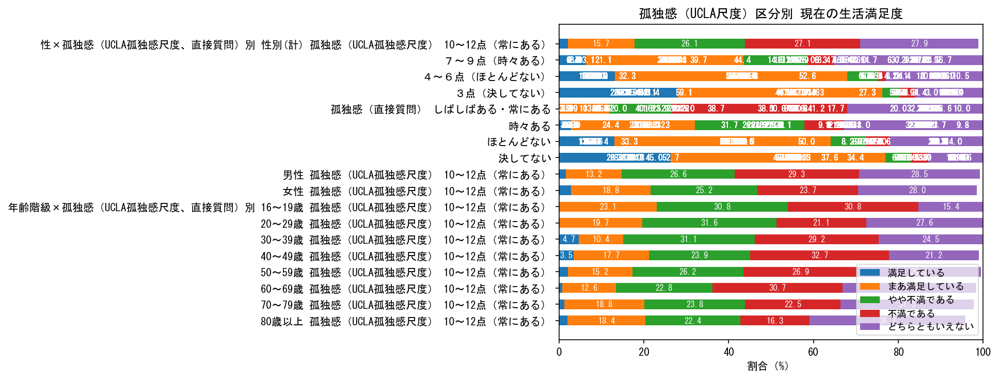
*📊 出典：令和6年度 孤独・孤立に関する実態調査（内閣府）シート1-47*

### 8.1 健康状態・生活満足度との関連

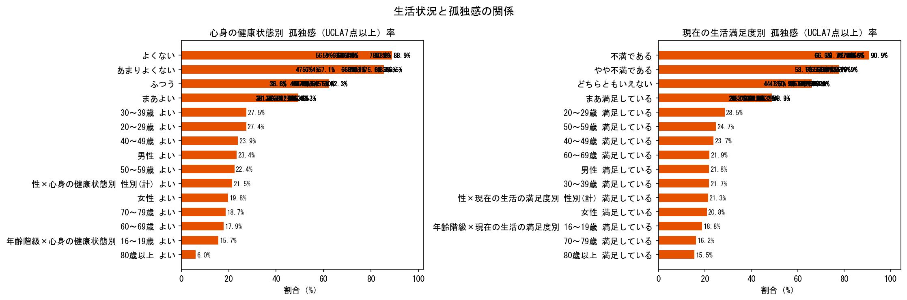
*📊 出典：令和6年度 孤独・孤立に関する実態調査（内閣府）シート1-25, 1-26*

📊 孤独感が高いほど：
- 心身の健康状態が低い
- 現在の生活満足度が低い

という傾向が一貫して示される。これは**「孤独→不健康・不満足→さらなる孤立」という悪循環（孤独の螺旋）** を示しており、早期介入の重要性を示唆している。

🌐 WHO「社会的決定要因フレームワーク（2003年）」では、社会的孤立が精神的健康と生活の質（QoL）の主要決定因子であることが示されている。孤独問題への対処は、医療・福祉コストの抑制にも直結する社会投資的課題である。

> 出典：WHO, "Social determinants of health: the solid facts", 2003

🌐 Tokio Marine の分析（2024年）によると、孤独は健康に与える影響として、**1日15本の喫煙と同等のリスク**を示すとされている（Holt-Lunstad et al. 研究に基づく）。

> 出典：[Tokio Marine Holdings "Loneliness, A Health Risk Like No Other"](https://www.tokiomarinehd.com/en/news_insights/ni29.html)

---

## 9. 総合考察と政策的示唆

### 9.1 主要知見サマリー

| テーマ | 主な知見（📊 データ由来） |
|--------|---------|
| **孤独感の規模** | UCLA7点以上（孤独感あり）45.7%、直接質問「時々以上」19.7%（26pt乖離） |
| **年齢・性別** | 若年層（20〜30代）での孤独感が高く、高齢者特有の問題ではない |
| **世帯構成** | 単身世帯で孤独感が顕著に高い |
| **職業・年収** | 無職・低年収層での孤独感高率、経済的困窮との複合 |
| **社会的交流** | 直接会って話す機会の不足と孤独感が強相関 |
| **社会参加** | 50.6%が「特に参加はしていない」。孤独感高層ほど不参加 |
| **フォーマル支援** | 受給率わずか7〜8%。情報アクセス障壁が主因 |
| **インフォーマル支援** | 頼れる人・相談相手の不在が孤独感と直結 |
| **完全孤立者** | 3つのサポートすべてない層が3.7%（推計約407万人） |
| **生活満足度** | 孤独感高スコア層で生活満足度・健康状態が著しく低い |

### 9.2 政策的示唆

#### 施策1：「孤独の自覚」を促す社会啓発
UCLA尺度と直接質問の乖離（約26pt）は、孤独を自覚しにくい日本の文化的課題を示す。「孤独は恥ではない」「助けを求めることは弱さではない」という社会的認識の変革とともに、孤独感測定ツールの普及・活用が必要である。

#### 施策2：情報アクセス障壁の解消（プッシュ型支援）
「支援の存在を知らない」「受け方がわからない」が支援につながれない主因。SNSを活用したプッシュ型情報提供、行政窓口・医療機関・学校等からのアウトリーチ支援の強化が必要である。

#### 施策3：ライフ移行期への重点支援
家族との死別、一人暮らしの開始、離職・退職などのライフイベント後に孤独感が増大する。これらの転換点を「支援介入タイミング」として捉え、プロアクティブな相談体制を整備することが求められる。

#### 施策4：若者・就労世代の孤立対策
20〜30代の孤独感の高さは、就労支援・ピアサポート・コミュニティ形成の観点からの対応が必要。企業によるメンタルヘルスケアや職場コミュニティの醸成も重要な役割を担う。

#### 施策5：複合孤立者への重層支援
「頼れる人・相談相手・気軽に話せる相手がすべていない」完全孤立者（推計407万人）には単一機関での対応は困難であり、多機関連携の重層的支援体制（アウトリーチ→つなぎ→定着支援）が不可欠。

### 9.3 データの限界

| 限界 | 内容 |
|------|------|
| **インターネット調査バイアス** | 最も孤立した層（ネット非利用者・高齢単身者）が過小評価される可能性 |
| **横断研究の限界** | 因果関係の特定には縦断研究が必要（例：スマホ多用→孤独 vs 孤独→スマホ多用） |
| **初回調査の限界** | 令和6年は4回目の調査だが、時系列比較では令和4年以降のみ比較可能 |
| **対象者差異** | ファイル04（支援調査）はn=8,084と他ファイルのn=10,871と異なる条件 |
| **地域粒度** | 都道府県別分析が困難であり、地域差の詳細把握には限界がある |

---

## 10. 参考文献・引用

### 一次資料（📊 本レポートのデータ源）

| 資料 | URL |
|------|-----|
| 内閣府「孤独・孤立の実態把握に関する全国調査（令和6年実施）」 | [cao.go.jp](https://www.cao.go.jp/kodoku_koritsu/torikumi/zenkokuchousa/r6.html) |
| 調査結果のポイント（PDF） | [cao.go.jp/pdf](https://www.cao.go.jp/kodoku_koritsu/torikumi/zenkokuchousa/r6/pdf/tyosakekka_point.pdf) |

### 政府・政策資料（🌐 Web由来）

| 資料 | URL |
|------|-----|
| 内閣府「孤独・孤立対策推進法」 | [cao.go.jp](https://www.cao.go.jp/kodoku_koritsu/torikumi/suishinhou.html) |
| 内閣府「孤独・孤立対策に関する重点計画（令和6年6月）」 | [cao.go.jp](https://www.cao.go.jp/kodoku_koritsu/torikumi/zenkokuchousa.html) |
| 内閣府「孤独・孤立対策について（令和6年9月）」 | [mhlw.go.jp](https://www.mhlw.go.jp/content/12000000/001309353.pdf) |
| 日本経済新聞「65歳以上の孤独死5.8万人、警察庁初集計」（2025年4月） | [nikkei.com](https://www.nikkei.com/article/DGXZQOUE1144T0R10C25A4000000/) |
| 野村総合研究所「今こそ企業が向き合うべき孤独・孤立」（2025年5月） | [nri.com](https://www.nri.com/jp/knowledge/report/files/000046467.pdf) |
| OECD "Supporting Japanese people affected by severe social isolation" (2025) | [oecd.org](https://www.oecd.org/en/blogs/2025/03/supporting-opportunities-insights-from-communities/supporting-japanese-people-affected-by-severe-social-isolation-a-case-study.html) |

### 学術・研究資料（🌐 Web由来）

| 資料 | 内容 |
|------|------|
| Holt-Lunstad J. et al. (2015), *Perspectives on Psychological Science* | 孤立と死亡リスク（29%上昇）のメタ分析 |
| Dunbar R.I.M. et al. (2019) | コミュニケーション手段と孤独感の関係 |
| WHO "Social determinants of health: the solid facts" (2003) | 健康の社会的決定要因フレームワーク |
| Vivek Murthy, "Together" (2020) | 孤独と公衆衛生 |
| Tokio Marine "Loneliness, A Health Risk Like No Other" | 孤独と喫煙同等リスク |
| OECD "Society at a Glance 2019" | 社会的孤立の国際比較 |

---

*本レポートは、令和6年度内閣府「孤独・孤立の実態把握に関する全国調査」集計データ（data02/）の分析と、2026年2月時点のWeb情報を組み合わせて作成した。*

*グラフ画像は `images/` フォルダに格納。ノートブック `analysis_report_data02.ipynb` で再生成可能。*
