# 孤独・孤立実態調査 分析レポート
## 令和6年度（2024年度）データ分析

**出典**: 孤独・孤立対策に関する実態調査（内閣官房 孤独孤立対策担当室）
**有効回答数**: 10,871人（孤独感調査）/ 8,084人（各種支援調査）
**調査対象**: 全国の一般市民（16歳以上）
**分析日**: 2026年3月13日

---

## エグゼクティブサマリー

本調査は、令和6年度（2024年度）に内閣官房が実施した「孤独・孤立対策に関する実態調査」の集計データを分析したものである。UCLA孤独感尺度と直接質問の2つの手法で孤独感を測定し、社会的交流・社会参加・行政支援の状況とのクロス集計を通じて、日本社会における孤独・孤立の多面的な実態を明らかにした。

**主要発見:**
- UCLA高孤独（10-12点）は全体の **6.5%**、合計で約半数（45.7%）が何らかの孤独感を抱えている
- **20〜30代の孤独感が最も高い**（UCLA高スコア 9〜10%）
- 求職中の孤独感が突出（18.6%）、ひとり世帯（9.9%）も高リスク
- 孤独感の高い層は社会参加率が約半減（24.3% vs 全体46.6%）
- 行政等の支援受給率はわずか 7.4% と低水準

---

## 1. 調査概要と測定方法

### 1.1 背景

日本政府は2021年に「孤独・孤立対策担当大臣」を設置し、孤独・孤立対策を重要施策として位置づけている 🌐。この取り組みは、新型コロナウイルス感染症の影響による社会的孤立の深刻化を受けたものである。令和6年度実態調査は、この政策効果の把握と今後の対策立案を目的に実施された。

### 1.2 孤独感の測定方法

| 測定法 | 概要 | 尺度 |
|--------|------|------|
| **UCLA孤独感尺度** | 「仲間はずれに感じる」「孤立していると感じる」「人と切り離されていると感じる」の3問の合計 | 3点（全くない）〜12点（常にある） |
| **直接質問** | 「孤独を感じることがあるか」を直接問う | しばしばある・常にある / 時々ある / たまにある / ほとんどない / 決してない |

UCLA孤独感尺度は間接的・客観的な測定法として世界各国で広く使用されており、直接質問との組み合わせにより孤独感の多面的把握が可能となっている 🌐。

---

## 2. 孤独感の実態

### 2.1 全体の孤独感分布（都市規模別）

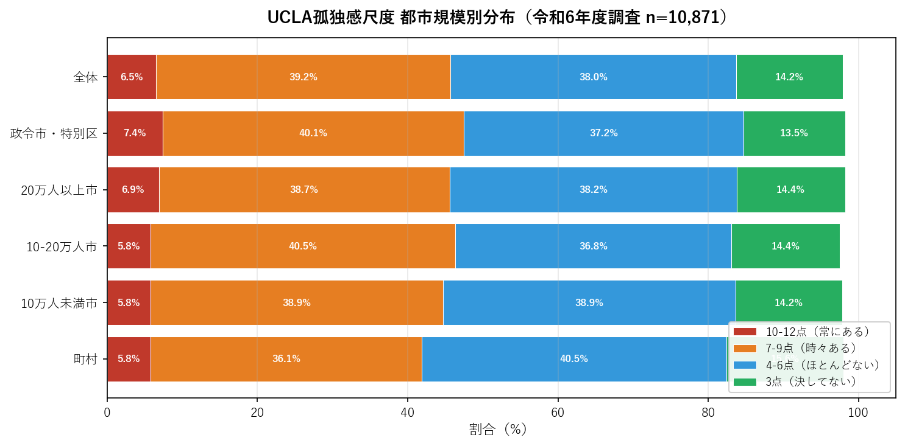
📊 *出典: 孤独・孤立対策に関する実態調査 令和6年度 第1-1表*

**全体の分布:**
- UCLA高スコア（10-12点「常にある」）: **6.5%**
- 中程度（7-9点「時々ある」）: **39.2%**
- 低スコア（4-6点「ほとんどない」）: **38.0%**
- 最低（3点「決してない」）: **14.2%**

合計で **45.7%** が何らかの孤独感を抱えており、これは約2人に1人に相当する。

都市規模別では差が小さく（高スコア率5.8〜7.4%）、孤独感は特定の地域に偏らない全国的な課題であることが確認された。政令市・特別区でやや高め（7.4%）が観測されており、都市部の匿名性・繋がりの希薄化が一因として考えられる。

### 2.2 年齢別の孤独感

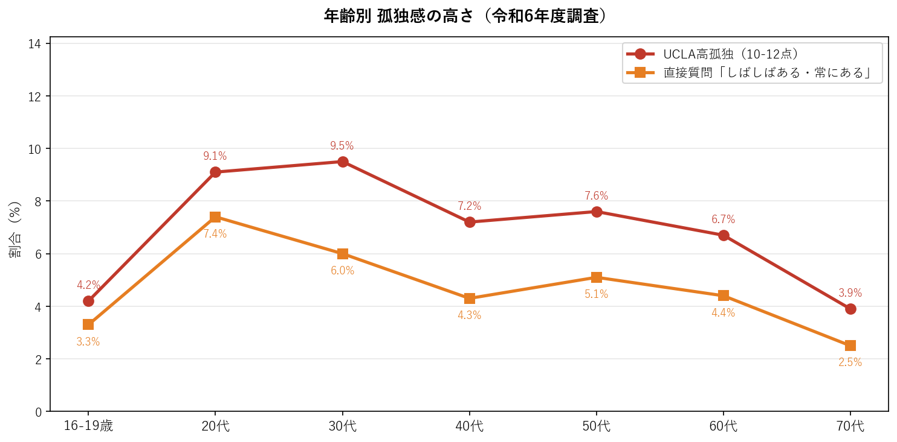
📊 *出典: 孤独・孤立対策に関する実態調査 令和6年度 第1-2表*

| 年齢層 | UCLA高スコア（10-12点） | 直接質問「しばしばある」 |
|--------|------------------------|------------------------|
| 16-19歳 | 4.2% | 3.3% |
| 20代 | **9.1%** | **7.4%** |
| 30代 | **9.5%** | **6.0%** |
| 40代 | 7.2% | 4.3% |
| 50代 | 7.6% | 5.1% |
| 60代 | 6.7% | 4.4% |
| 70代 | 3.9% | 2.5% |
| **全体** | **6.5%** | **4.3%** |

📊 *出典: 令和6年度実態調査 第1-2表*

**最重要発見：20〜30代の孤独感が全年齢で最高水準**。UCLA高スコアは20代9.1%、30代9.5%と全体平均の約1.5倍を記録した。これは就職・転居・人間関係の断絶等のライフイベントが集中する時期と重なる。

高齢層（70代3.9%）は相対的に低いが、コミュニケーション頻度の低下という形での孤立は後述のとおり高水準にある点に注意が必要である。

### 2.3 世帯構成別の孤独感

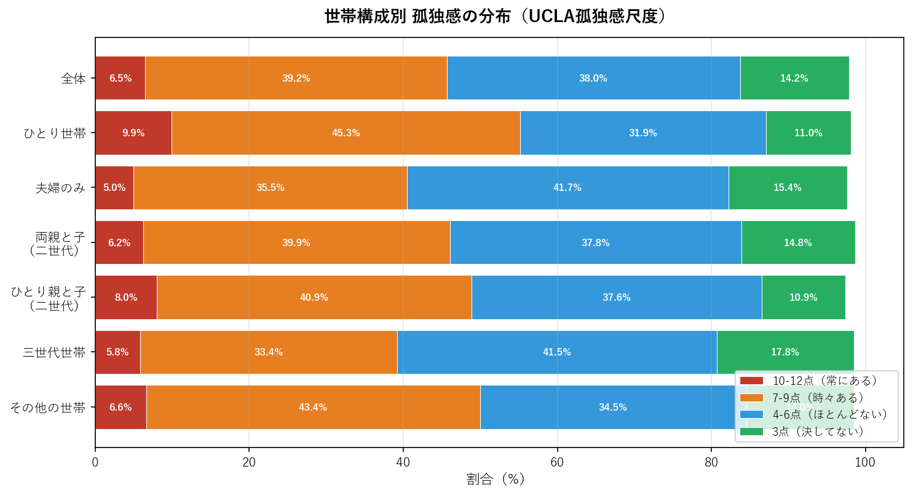
📊 *出典: 令和6年度実態調査 第1-5表*

**ひとり世帯の孤独感が最も深刻**（UCLA高スコア9.9%）。夫婦のみ世帯（5.0%）が最低であり、安定したパートナーシップが孤独感の保護因子として機能していることが示唆される。

### 2.4 就業状況別の孤独感

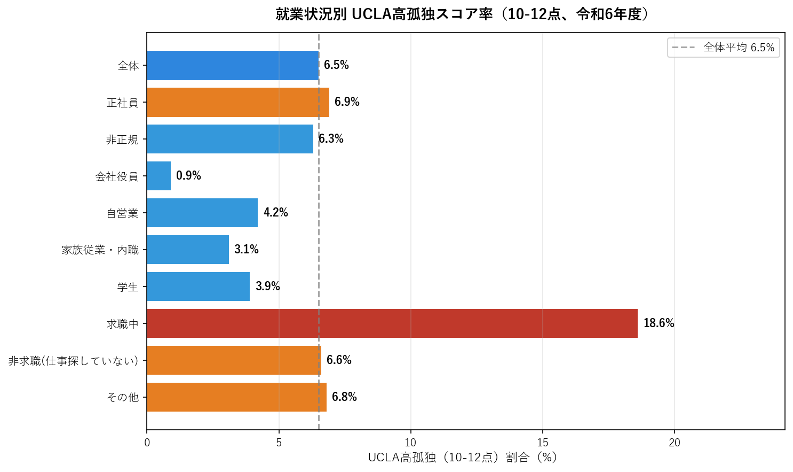
📊 *出典: 令和6年度実態調査 第1-7表*

**求職中（仕事を探している）の18.6%**は全カテゴリで突出して高く、全体平均の約2.9倍。就業不安定・経済的不安が孤独感の強力な促進要因であることを示している。

一方、会社役員（0.9%）は最低であり、社会的地位と経済的安定が孤独感の緩衝として機能している可能性がある。

### 2.5 社会参加有無別の孤独感（クロス分析）

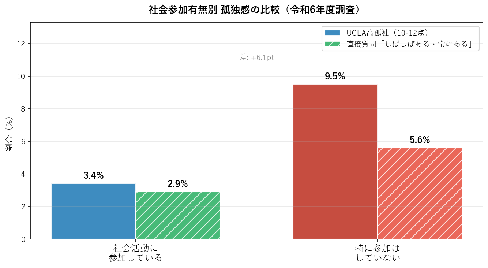
📊 *出典: 令和6年度実態調査 第1-17表*

社会活動に参加している群のUCLA高スコアは **3.4%** に対し、参加していない群は **9.5%**（差：+6.1pt）。この差は孤独感と社会参加の間に強い関連があることを示している。ただし、因果の方向性（孤独だから参加しないのか、参加しないから孤独になるのか）は本データのみからは確認できない。

---

## 3. 社会的交流の実態

### 3.1 コミュニケーション手段別の頻度分布

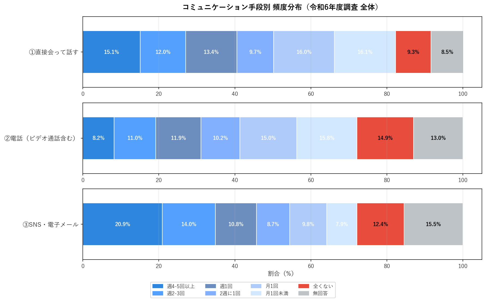
📊 *出典: 令和6年度実態調査 第2-1表*

同居していない家族・友人とのコミュニケーション頻度を3つの手段で測定した結果、**③SNS・電子メールが最も高頻度**（週4-5回以上20.9%）で現代のコミュニケーションの主役となっている。

直接会っての交流で「全くない」が **9.3%** と最も高い。これは対面交流の機会が失われた層の存在を示しており、社会的孤立の指標として注目に値する。

### 3.2 年齢別コミュニケーション「全くない」率

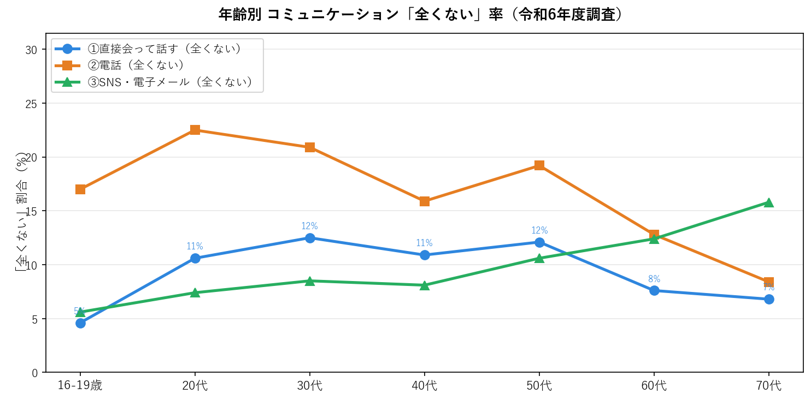
📊 *出典: 令和6年度実態調査 第2-2表*

**70代では直接会っての「全くない」率が16.5%**（16-19歳の4.6%の3.6倍）と大幅に上昇。一方、SNS利用の「全くない」率も70代では高く、デジタルデバイドが高齢者のコミュニケーション手段を限定している現状が明らかになった。

中年層（40-50代）では電話での「全くない」率が比較的高い傾向が見られる。これは仕事中心の生活スタイルや家族・友人との電話コミュニケーションの減少を反映しているものと考えられる。

---

## 4. 社会参加の実態

### 4.1 社会活動への参加状況

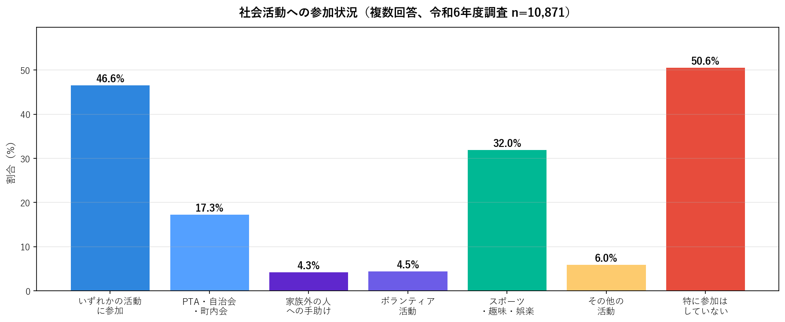
📊 *出典: 令和6年度実態調査 第3-1表*

いずれかの社会活動に参加している割合は **46.6%**（約半数）。最多はスポーツ・趣味・娯楽（32.0%）で個人的な活動が主体。地域コミュニティ活動（PTA・自治会17.3%）への参加も一定数みられる。

**特に参加なしは50.6%** と過半数が何の社会活動も行っていない。

### 4.2 年齢別社会参加率の推移

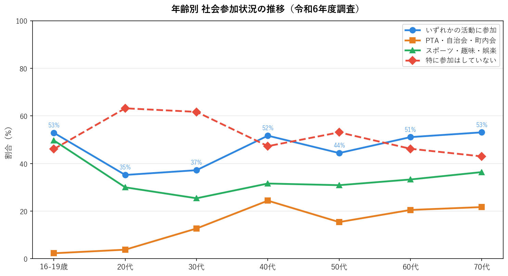
📊 *出典: 令和6年度実態調査 第3-2表*

20代の「特に参加なし」率が63.2%と高く、若年層の社会参加率の低さが孤独感の高さと対応している。40代以降では参加率が回復し、70代では53.1%と高水準になる（特にPTA・自治会参加が増加）。

### 4.3 孤独感レベル別の社会参加率

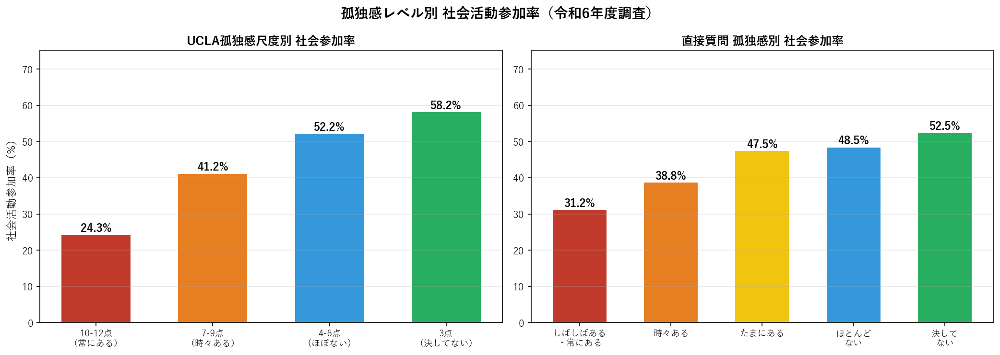
📊 *出典: 令和6年度実態調査 第3-17表*

UCLA孤独感が最高（10-12点）の層では社会参加率が **24.3%** と全体の約半分に低下。孤独感と社会参加の間には明確な逆相関が確認される。

| UCLA孤独感スコア | 社会参加率 |
|---|---|
| 10-12点（常にある） | **24.3%** |
| 7-9点（時々ある） | 41.2% |
| 4-6点（ほとんどない） | 52.2% |
| 3点（決してない） | 58.2% |

📊 *出典: 令和6年度実態調査 第3-17表*

---

## 5. 行政・NPO等からの支援状況

### 5.1 支援受給状況（都市規模別）

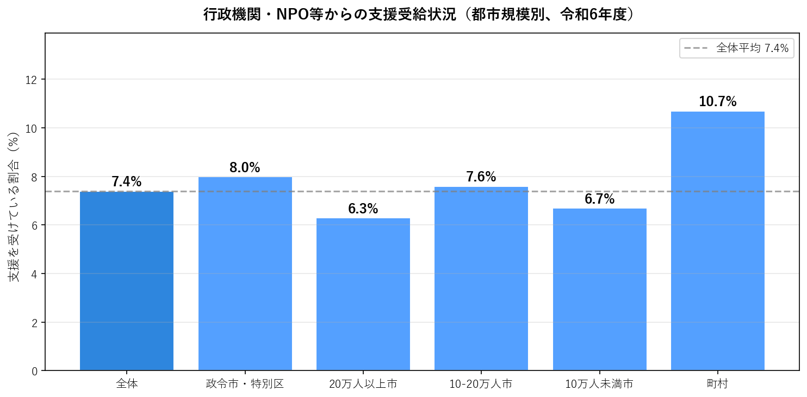
📊 *出典: 令和6年度実態調査 第4-1表*

行政機関・NPO等からの支援を「受けている」と回答した割合は全体でわずか **7.4%**。約9割以上が公的支援を受けていないという現実が明らかになった。

都市規模別では町村（10.7%）が最高であり、農村部での互助システムや行政の関与が比較的高いことを示している。一方、20万人以上の都市では6.3%と最低水準であり、都市部での支援アクセスのミスマッチが課題となっている。

支援を受けていない理由（別シート参照）としては「必要としていない」「どこに相談すればよいかわからない」等が多い。

---

## 6. 生活満足度と孤独感の関係

### 6.1 生活満足度別の孤独感分布

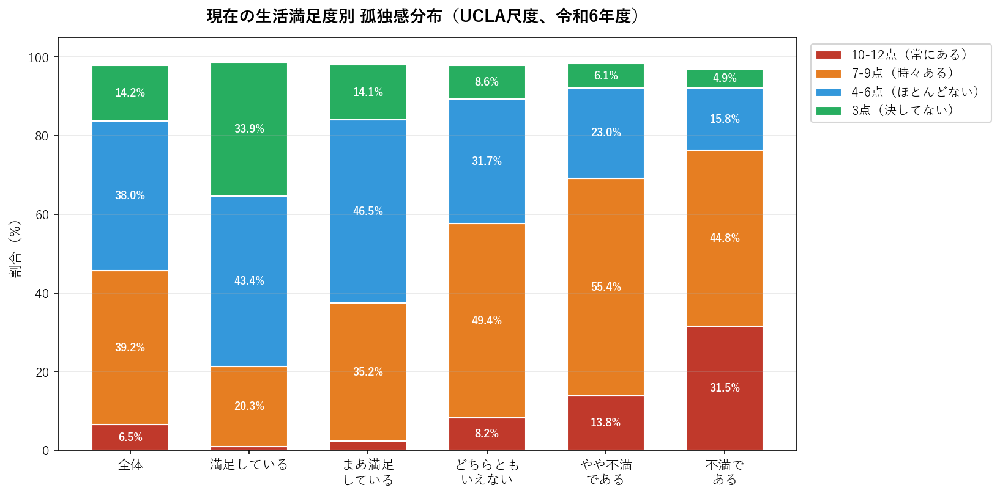
📊 *出典: 令和6年度実態調査 第1-26表*

生活満足度と孤独感の間には極めて強い相関が確認された：

| 生活満足度 | UCLA高スコア（10-12点） |
|---|---|
| 満足している | **1.0%** |
| まあ満足している | 2.3% |
| どちらともいえない | 8.2% |
| やや不満である | 13.8% |
| 不満である | **31.5%** |

📊 *出典: 令和6年度実態調査 第1-26表*

「不満である」群のUCLA高スコア31.5%は「満足している」群の31倍以上。生活満足度と孤独感は双方向の強い関連を持つと考えられる。

---

## 7. 総合考察

### 7.1 孤独感に関連する主要因子（強い順）

本調査データから抽出された孤独感への影響因子を影響度順に整理する：

1. **生活満足度** — 「不満」群と「満足」群の差：+30.5pt（最大の格差）
2. **就業状況** — 求職中と全体平均の差：+12.1pt（就業安定の重要性）
3. **社会参加有無** — 非参加群と参加群の差：+6.1pt
4. **世帯構成** — ひとり世帯と全体の差：+3.4pt
5. **年齢** — 30代が最高（9.5%）、70代が最低（3.9%）
6. **都市規模** — 差は±1.6ptで影響は小さい

### 7.2 孤独・孤立の構造的問題

本データからは、孤独感と社会的孤立が相互に強化し合う**負のサイクル**の存在が示唆される：

```
低社会参加 ←─────────────────┐
     ↓                      |
  孤独感増加                 |
     ↓                      |
  生活満足度低下             |
     ↓                      |
  社会参加障壁の増加 ─────────┘
```

特に求職中の若年層や単身世帯では、経済的不安定・社会的つながりの希薄さが複合的に作用している可能性が高い。

### 7.3 政策的示唆

| 対象 | 課題 | 推奨施策 |
|------|------|---------|
| **若年層（20-30代）** | 孤独感が全年齢最高 | キャリア支援との連動・ソーシャルスペースの提供 |
| **求職中の人** | 孤独感が突出（18.6%） | ハローワーク等でのメンタルサポート強化 |
| **単身世帯** | 孤独感9.9%と高水準 | 地域コミュニティとの接続支援 |
| **高齢単身者** | 直接交流「全くない」16.5% | 訪問支援・デジタル活用支援 |
| **支援非受給者** | 92.6%が支援を受けず | 支援情報の周知・ワンストップ相談窓口の充実 |

### 7.4 データの限界

- クロス集計データのみのため、因果関係の確認はできない
- 調査時点のスナップショットであり、年度比較には別ファイルのデータが必要
- 「無回答」層の特性が不明であり、バイアスの可能性がある
- オンライン調査の方法論的限界（デジタルデバイドを抱える高齢者の過少代表の可能性）

---

## 参考資料

### データ出典
- 📊 内閣官房 孤独孤立対策担当室「孤独・孤立対策に関する実態調査 令和6年度（2024年度）」
- 📊 調査ファイル: `data03/01.孤独感に関する集計表/01 孤独感に関する集計表(r6)20250423.xlsx` 他

### 関連政策・背景
- 🌐 [内閣官房 孤独・孤立対策 公式ページ](https://www.cas.go.jp/jp/seisaku/kodoku_koritsu_taisaku/)
- 🌐 [孤独・孤立対策推進法（令和5年）](https://www.cas.go.jp/jp/seisaku/kodoku_koritsu_taisaku/suishin_law.html)
- 🌐 [令和6年度 孤独・孤立対策の重点計画](https://www.cas.go.jp/jp/seisaku/kodoku_koritsu_taisaku/index.html)

### UCLA孤独感尺度について
- 🌐 UCLA Loneliness Scale (Version 3)（Russell, 1996）の日本語版を使用。3問の合計点（3〜12点）で孤独感を客観的に測定する国際標準の測定ツール。

---

*分析: 令和6年度 孤独・孤立対策実態調査データより*
*レポート作成日: 2026年3月13日*
